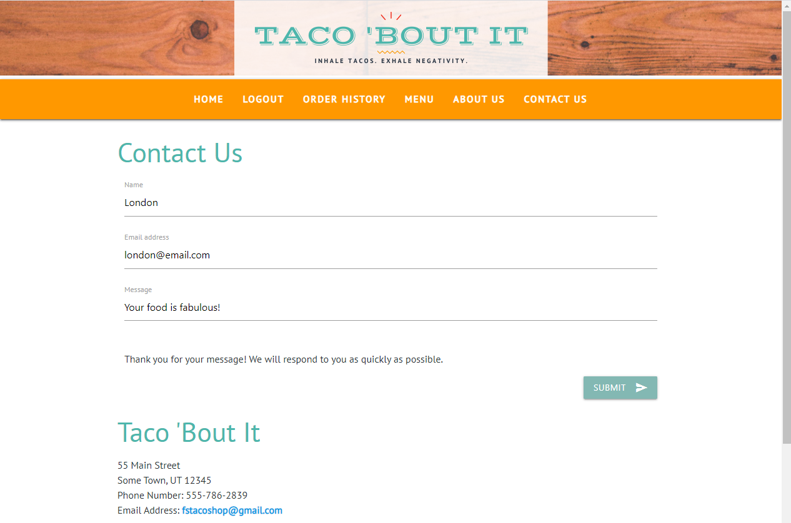

# Taco Shop

# Table of Contents:
  
- [Taco Shop](#taco-shop)
- [Table of Contents:](#table-of-contents)
  - [Description:](#description)
  - [Installation Instructions:](#installation-instructions)
  - [Usage Information:](#usage-information)
  - [License:](#license)
  - [Contributors:](#contributors)

## Description: 

Our site is a full-service application for a Mexican restaurant. A user can view the menu, place an order including payment, send a message to us, view our story, and find our store location and hours. The application was made using Javascript, GraphQL, MongoDB, JWT, and React. We also used Twilio Sendgrid to allow contact information to be sent to an employee via email.

## Installation Instructions:

This application can be cloned at https://github.com/amiedawn/taco-shop .

## Usage Information:

To view this deployed application, simply go to https://quiet-beach-11732.herokuapp.com/ . Here is a preview of the home screen:     Our menu where you can place an order:     Our Contact Us page which successfully submits information to our restaurant and gives the user feedback:    

## License:

This site is under this license: MIT

For details on this license, please follow: https://opensource.org/licenses/MIT

## Contributors:

Kelsey Freeborg, Kristin Moon, Benjamin McRae, and Amie Carroll
